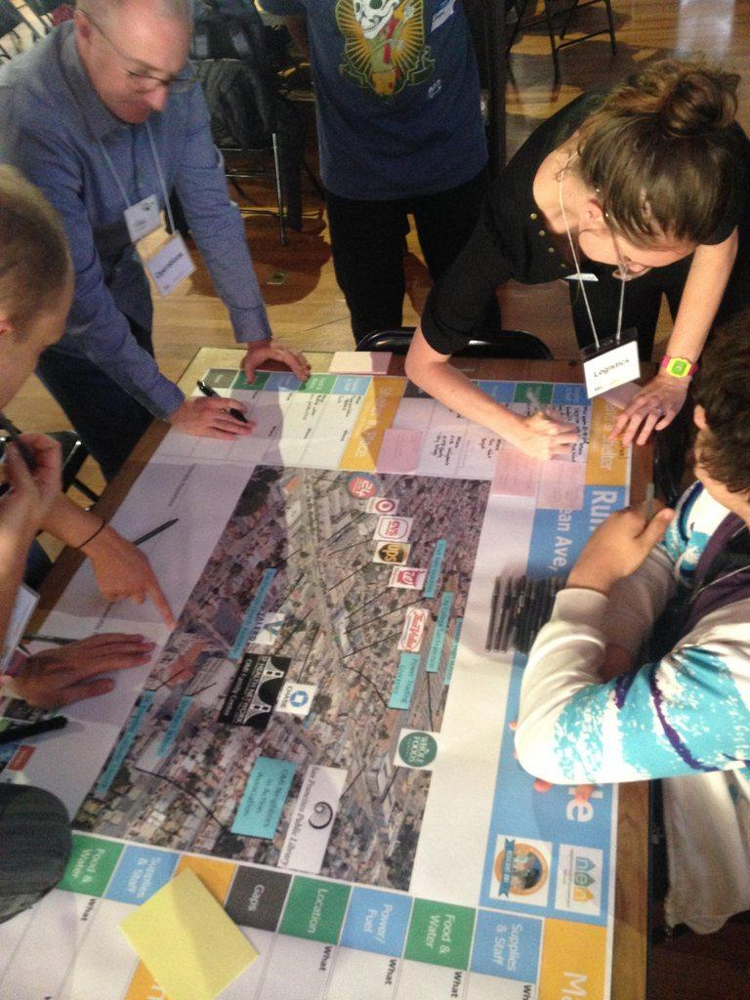

---
authors:
- allen_meyer
- celia_moreno
date: '2017-10-17'
published: true
title: 'National Day of Civic Hacking 2017: How We Learned to Deal with Disasters'
description: Live long enough in California and you might experience an earthquake, wildfire, catastrophic flood from winter rains, extreme drought, and those are just the natural events. C4SF decided to do something a little different this year for NDoCH. Rather than a two or three day event, we decided to do a one-day deeper exploration of resilience and disaster preparedness in our neighborhoods.
image: team.jpg
image_alt: Run Your Resilientville Team Photo
---

Live long enough in California and you might experience an earthquake, wildfire, catastrophic flood from winter rains, extreme drought, and those are just the natural events. C4SF decided to do something a little different this year for NDoCH. Rather than a two or three day event, we decided to do a one-day deeper exploration of resilience and disaster preparedness in our neighborhoods.

To create something that is truly relevant to the communities we hope to engage, we decided to immerse ourselves in human centered design principles. We asked [Megan Goering](https://www.linkedin.com/in/megangoering/) to give us a deep dive in human centered design. Megan is an Google veteran and now works as a international consultant,
>“My work scales the tools, methods, and creative practices of the tech world in San Francisco / Silicon Valley to those empowering their communities to address humanity's most pressing problems.”

Perfect. With Megan’s insight, we hoped to be able to better understand how we might address the real world needs of neighborhood emergency responders. It wouldn’t be a human centered design session if we didn’t come up with a “how might we” statement. Ours is: “How might we empower people in times of stress through a shared asset map.”

With the aim of inspiring our resiliency project, Code for San Francisco brought practitioners from the [Neighborhood Empowerment Network](https://empowersf.org/) and the [Department of Emergency Management's SF72](https://sf72.org) to show attendees how preparedness works in SF today. Megan had equipped attendees with human centered design tools to help prototype civic tech solutions around resiliency. Now it was time to get serious.

## Not your usual hackathon

Daniel Homsey, Director of the Neighborhood Empowerment Network, enthusiastically guided attendees off their feet and into working mode. He began the tabletop exercise abruptly and with little notice, to imagine San Francisco had just been hit by a 7.1 magnitude earthquake to simulate an actual disaster. He gave instructions on creating and utilizing the HUB Incident Command System (ICS) which was practiced by completing the exercise, “Run Your Resilientville.”

During the exercise, participants split into three groups. One person in each group was designated the leader, who then assigned other members a ‘logistics’ or ‘operations’ role. The tabletop map was an aerial view of Ocean Avenue in the Ocean View/Merced Heights/Ingleside district of San Francisco.

Participants were first asked to identify the community’s vulnerable populations and how they would be impacted by a large magnitude earthquake. Facilitated by the leader, the group addressed three categories: central shelter, shelter in place, and mass feeding. The ‘operations’ team identified needs in terms of supplies, food/water, power, and medical supplies for the designated number of people per category. The ‘logistics’ team located where and addressed how these things could be attained. Throughout the exercise, the group recognized gaps within each category.

Once the table top exercise was complete, each individual group debriefed their maps. The leaders of the incident command system presented their performance gaps and potential for improvement. The consensus was that everyone could benefit from being more prepared and having a system in place for times of stress.

Now it was time for our challenge from Daniel: sustainably empower people in times of stress with a shared asset map. The concept is an asset map that shows where community leaders can find resources in case of emergency, and to map those assets before the emergency strikes. Assets such as generators, medical supplies and grocery store managers that will distribute refrigerated food rather than have it go bad if power is down. The final part of the day was spent with attendees split into three groups to consider how to collect, exchange and visualize data related to asset mapping.

The outcome of the day was a deeper understanding of how to apply human centered design skills to a real world challenge. The Brigade is continuing the work in our Resiliency Mapping project with a core group meeting every Wednesday night at Hack Night. Join us, we could use your help.

In addition to joining us at hack night to contribute skills to a more resilient SF, here are some things you should do today to increase personal, family and community resiliency:

* Register for AlertSF by texting your zipcode to 888-777; you’ll receive public safety alerts
* Review your emergency kit supplies and visit [SF72.org](https://sf72.org) to find out what you’re missing
  * Make a commitment to purchase/make each of those missing items
* Have a conversation with your friends and family about your disaster plan; pick a place to meet and an out-of-state point of contact to check in with if something should happen
* [Sign up to host a Neighborfest block party](https://empowersf.org/neighborfest) through the Neighborhood Empowerment Network
